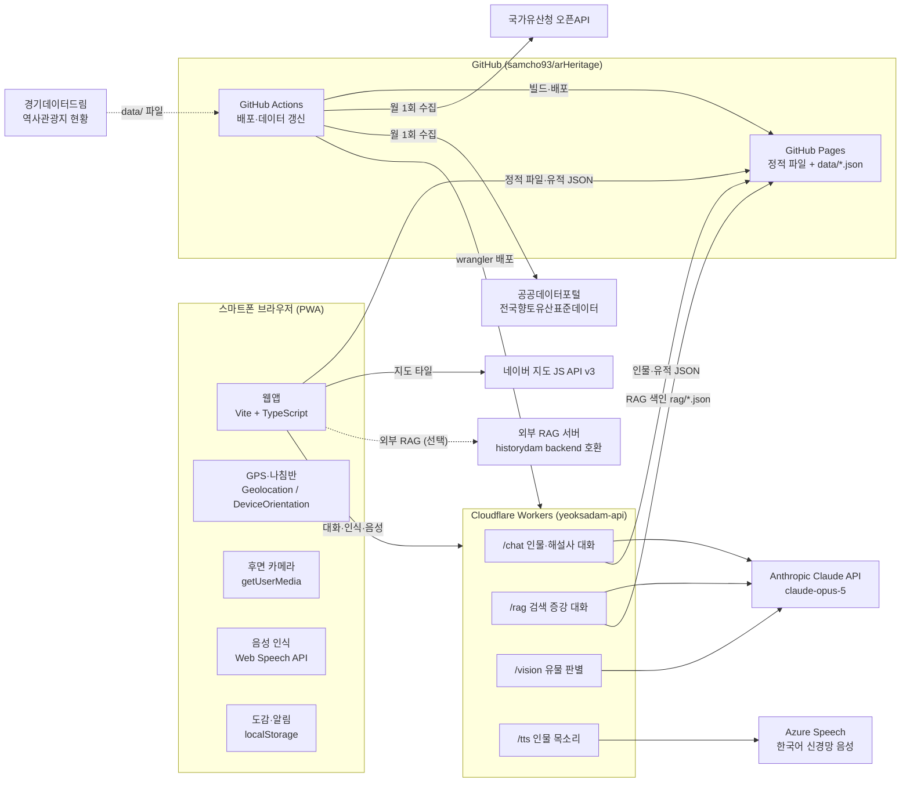
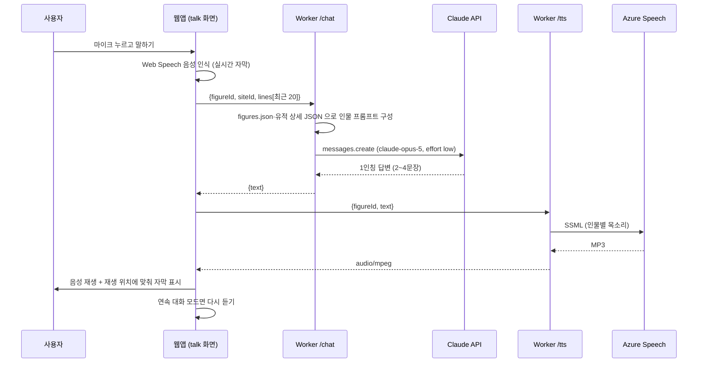
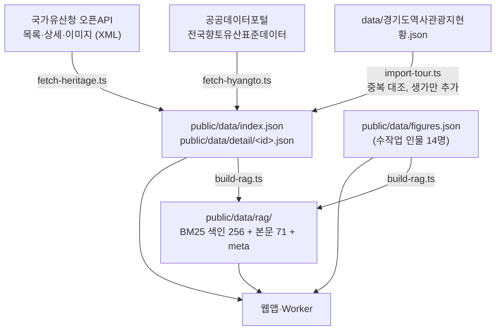
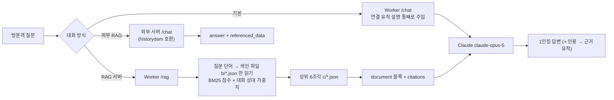
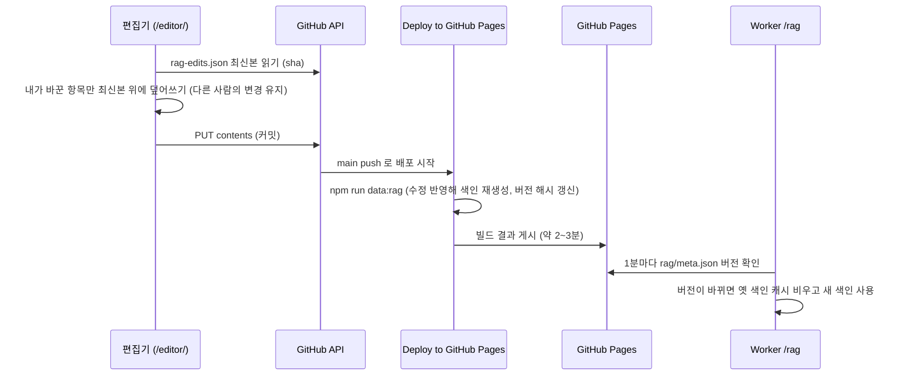

# 역사담 (歷史談) — AR 역사 인물·유적 안내 웹앱

> 유적지 현장에서 스마트폰 카메라를 비추면 주변 유적이 AR로 떠오르고, 그 유적과 관련된 역사 인물(또는 해설사)과
> **얼굴을 마주 보며 음성으로 대화**하는 웹앱입니다. 시범 지역은 **경기도**입니다.

> 📱 **앱 사용법(화면 캡처 안내)은 [USAGE.md](USAGE.md)** 에 있습니다. 이 문서는 개발·구성 설명입니다.

- 배포 주소: **https://samcho93.github.io/arHeritage/**
- 대화·음성·인식 서버: **https://yeoksadam-api.samdori93.workers.dev**
- 디자인 원본: Android 앱 [historydam(역사담)](https://github.com/Hanbyeol5/historydam)의 화면 목업(단청·한지 테마, 8개 화면)

---

## 목차

1. [주요 기능](#1-주요-기능)
2. [시스템 구성도](#2-시스템-구성도)
3. [기술 스택](#3-기술-스택)
4. [디렉터리 구조](#4-디렉터리-구조)
5. [데이터 파이프라인](#5-데이터-파이프라인)
6. [웹앱 구조](#6-웹앱-구조)
7. [위치 기반 AR](#7-위치-기반-ar)
8. [지도 (네이버 지도)](#8-지도-네이버-지도)
9. [역사 인물·해설사 대화 (RAG 서버 선택 포함)](#9-역사-인물해설사-대화)
10. [음성 (말하기·듣기)](#10-음성-말하기듣기)
11. [유물·건물 인식 카메라](#11-유물건물-인식-카메라)
12. [인물 초상과 AR 컷아웃](#12-인물-초상과-ar-컷아웃)
13. [도감·알림 (기기 내 저장)](#13-도감알림-기기-내-저장)
14. [PWA·전체 화면·몰입 모드](#14-pwa전체-화면몰입-모드)
15. [배포 (GitHub Pages · Cloudflare Workers)](#15-배포-github-pages--cloudflare-workers)
16. [로컬 개발 절차](#16-로컬-개발-절차)
17. [키·비밀값 관리](#17-키비밀값-관리)
18. [비용과 사용 한도](#18-비용과-사용-한도)
19. [알려진 한계](#19-알려진-한계)
20. [출처·라이선스](#20-출처라이선스)

---

## 1. 주요 기능

| 화면 | 기능 |
|---|---|
| **홈 · 내 주변 인물** | 현재 위치에서 가까운 역사 인물을 초상 메달로 보여 주고, 좌우로 넘기며 거리를 표시 |
| **인물 선택** | 초상을 누르면 배경이 어두워지며 [관련 유적지 / 대화하기], ↑ 버튼으로 인물 소개·초상 출처 |
| **AR 카메라** | 후면 카메라에 반경 1·3·5·10km 안의 유적을 라벨로 표시, 겹치면 대표 유적만 + `+N`, 누르면 안내·길찾기·대화 |
| **AR 방향 안내** | 목표 유적(또는 인물이 있는 유적)으로 화살표와 남은 거리 안내 |
| **인물·해설사 대화** | 후면 카메라 위에 배경을 제거한 인물이 서 있고, 라이브 방송 자막처럼 대화가 흐름. 내 음성 → 글자, 인물의 말 → 글자 + 음성 |
| **대화 방식 선택 (RAG)** | 메뉴 설정에서 기본 / **RAG 서버(역사담 내장: 질문마다 유적 자료 검색 + 근거 표시)** / 외부 RAG 서버(historydam 호환) 선택 |
| **RAG 자료 편집기** | 웹앱과 분리된 `/editor/` 페이지에서 RAG 자료를 고치기·빼기·추가 → GitHub 에 반영하면 색인이 다시 만들어져 대화에 쓰임 |
| **지도** | 네이버 지도에 인물 핑·유적 핀·내 위치, 「○○까지 걷기 · 도보 N분」, [찾기] → AR |
| **유물·건물 인식** | 촬영 → 주변 국가유산 후보 + Claude 비전 판별 → 국가유산청 공식 설명으로 보강, 후보로 보정, 음성 해설 |
| **모든 인물** | 가나다순(초성 색인)·주변 순, 검색, 미발견 인물은 잠긴 메달 |
| **역사의 전당** | 유적지·인물·유물 도감(발견일, 상세, 삭제), 닉네임 |
| **알림** | 앱이 열려 있는 동안 유적지 150m 안에 들어오면 도착 알림·도감 기록 |

데이터 규모 (현재): 유적 **1,486곳** (국가유산청 815 + 향토유산 668 + 역사관광지 생가 3), 역사 인물 **14명**.

---

## 2. 시스템 구성도

### 2.1 전체 구성



### 2.2 인물과 대화할 때의 흐름



### 2.3 데이터 파이프라인



---

## 3. 기술 스택

| 영역 | 기술 | 사용 위치 / 용도 |
|---|---|---|
| 언어 | **TypeScript** | 웹앱(`src/`), 데이터 스크립트(`scripts/`), Worker(`worker/`) |
| 빌드 | **Vite 8** | 개발 서버·번들링, `BASE_PATH` 로 GitHub Pages 하위 경로 대응 |
| UI | **순수 TypeScript + DOM** (프레임워크 없음) | 해시 라우터(`router.ts`)와 화면 모듈(`screens/*`) |
| 스타일 | **CSS 변수** (단청·한지 팔레트) | `style.css` — historydam 목업 CSS 값 1:1 |
| 글꼴 | Google Fonts: **나눔명조, 고운바탕, Noto Sans KR** | 제목·인물명(명조), 본문(고딕) |
| PWA | **vite-plugin-pwa** (Workbox) | 오프라인 캐시, 홈 화면 설치, 전체 화면 매니페스트 |
| 지도 | **네이버 지도 JavaScript API v3** | 인물 핑·유적 핀·내 위치 (`naverMap.ts`) |
| 위치 | **Geolocation API** (`watchPosition`) | 현재 위치 추적, 도착 판정 (`location.ts`) |
| 방향 | **DeviceOrientation API** | 나침반 방위·기울기, iOS `webkitCompassHeading` (`orientation.ts`) |
| 카메라 | **MediaDevices.getUserMedia** | AR·대화·유물 인식의 후면 카메라 |
| 음성 인식 | **Web Speech API** (`SpeechRecognition`) | 내 말을 실시간 자막으로 (`speech.ts`) |
| 음성 합성 | **Azure Speech** (신경망, 서버) → **Web Speech** `speechSynthesis` (기기, 대체) | 인물 목소리 |
| 대화·인식 AI | **Anthropic Claude API** (`claude-opus-5`), `@anthropic-ai/sdk` | 인물 페르소나 대화, 유물 사진 판별 |
| 서버 | **Cloudflare Workers** + **wrangler** | API 키 보관·중계 (`worker/src/index.ts`) |
| 입력 검증 | **zod** | Worker 요청 검증, 비전 구조화 출력 스키마 |
| 검색 (RAG) | **BM25** (한글 바이그램 역색인, 정적 분할 파일) + Claude **citations** | `scripts/build-rag.ts`, `worker/src/ragText.ts`, Worker `/rag` |
| 데이터 수집 | Node.js 24 + **tsx**, **fast-xml-parser** | `scripts/*.ts` |
| 호스팅 | **GitHub Pages** | 정적 웹앱·데이터 JSON |
| CI/CD | **GitHub Actions** | Pages 배포, Worker 배포, 월간 데이터 갱신 |
| 초상 처리 | Z-Image Turbo(생성), **@imgly/background-removal-node** + **sharp**(배경 제거) | `public/figures/*` 제작 (빌드와 별개로 1회 작업) |

---

## 4. 디렉터리 구조

```
arHeritige/
├─ index.html                 앱 셸 + 인물 일러스트·전신 실루엣 SVG(defs)
├─ editor/index.html          RAG 자료 편집기 페이지 (웹앱에 링크 없음)
├─ vite.config.ts             base 경로, PWA 매니페스트(fullscreen)·Workbox 캐시 규칙
├─ public/
│  ├─ icon.svg                앱 아이콘(談)
│  ├─ figures/                인물 초상 <id>.jpg + 배경 제거 컷아웃 <id>-cutout.webp
│  └─ data/
│     ├─ index.json           지도·AR용 유적 목록(1,486곳, 경량)
│     ├─ detail/<id>.json     유적 상세(설명·사진·주소·전화)
│     ├─ figures.json         역사 인물(초상·목소리·관련 유적)
│     ├─ rag-edits.json       RAG 자료 편집기의 수정 사항 (글 바꾸기·제외·추가)
│     └─ rag/                 RAG 검색 색인 (meta.json, b/0~255.json, c/0~70.json)
├─ scripts/                   데이터 수집 (빌드 시점)
│  ├─ fetch-heritage.ts       국가유산청 오픈API → index/detail
│  ├─ fetch-hyangto.ts        공공데이터포털 향토유산 → index/detail(hy-*)
│  ├─ import-tour.ts          경기도 역사관광지 → 중복 대조·생가 추가(tr-*)
│  └─ build-rag.ts            유적 설명·인물 소개 + rag-edits.json → RAG 색인(public/data/rag)
├─ data/경기도역사관광지현황.json   역사관광지 원본(경기데이터드림)
├─ src/
│  ├─ main.ts                 하단 5탭, 라우팅, 시작 화면, 전체 화면·오디오 잠금 해제
│  ├─ router.ts               해시 라우터 (#/home, #/map, #/ar, #/talk/<id> …)
│  ├─ app.ts                  앱 상태: 유적·인물 로드, 주변 계산, 도착 판정
│  ├─ data.ts                 index/detail JSON 로드·캐시, 반경 검색
│  ├─ geo.ts                  거리(haversine)·방위각·각도차
│  ├─ location.ts             GPS 추적(?lat=&lng= 로 위치 고정 가능)
│  ├─ orientation.ts          나침반·기울기 센서, 저역통과 필터
│  ├─ arEngine.ts             AR 라벨 배치·겹침 정리·목표 방향
│  ├─ naverMap.ts             네이버 지도 래퍼(한 번 생성해 재사용)
│  ├─ speech.ts               음성 출력(서버→기기)·음성 인식, 자동 재생 대응
│  ├─ conversation.ts         대화 세션(인물별 기억)·대화 방식(기본/RAG/외부 RAG)별 호출
│  ├─ vision.ts               사진 캡처·AI 판별·위치 기반 대체
│  ├─ guide.ts                인물이 없는 유적의 해설사
│  ├─ heritageSheet.ts        유적 상세 카드, 바텀 시트 공용
│  ├─ figureSheet.ts          인물 선택(딤 시트)·관련 유적
│  ├─ siteActions.ts          AR 라벨 동작 카드·겹친 유적 목록·네이버 길찾기
│  ├─ store.ts                도감·알림·닉네임·대화 방식 설정 (localStorage)
│  ├─ types.ts                데이터 타입
│  ├─ style.css               단청·한지 테마 전체 스타일
│  ├─ editor/                 RAG 자료 편집기 (main.ts · editor.css)
│  ├─ screens/                home · map · ar · talk · camera · qa · figures · profile · notifications
│  └─ ui/                     icons · medal(초상 메달) · chrome(상단바) · dom · josa(조사) · immersive
├─ worker/                    Cloudflare Worker (대화·인식·음성 API)
│  ├─ src/index.ts            /chat · /rag · /vision · /tts
│  ├─ src/ragText.ts          RAG 토큰화·색인 파일 규칙 (색인 생성과 공용)
│  └─ wrangler.toml           vars, workers.dev, 실행 위치 고정(placement)
└─ .github/workflows/
   ├─ deploy.yml              웹앱 빌드 → GitHub Pages
   ├─ deploy-worker.yml       Worker 배포 + 비밀값 등록
   └─ update-data.yml         매월 유적 데이터 재수집·커밋
```

---

## 5. 데이터 파이프라인

모든 유적 데이터는 **빌드 시점에 수집해 정적 JSON 으로** 둡니다. 공공 API 대부분이 XML·http 전용이거나 브라우저 직접 호출(CORS)을 막기 때문이며, 덕분에 앱은 서버 없이 빠르게 동작합니다.

### 5.1 국가유산청 오픈API — `scripts/fetch-heritage.ts`

| 단계 | 내용 |
|---|---|
| ① 목록 | `https://www.khs.go.kr/cha/SearchKindOpenapiList.do?ccbaCtcd=31&pageUnit=300&pageIndex=N` (경기 = `31`), 키 불필요 |
| ② 선별 | 지정 해제(`ccbaCncl=Y`)와 좌표 0 인 항목 제외 → **815건** |
| ③ 상세 | `SearchKindOpenapiDt.do?ccbaKdcd&ccbaAsno&ccbaCtcd` → 분류(`gcodeName` 등)·시대·소재지·설명(`content`) |
| ④ 이미지 | `SearchImageOpenapi.do` → 사진 최대 6장, **http → https 로 변환**(HTTPS 페이지 혼합 콘텐츠 차단 방지) |
| ⑤ 출력 | `index.json`(id·이름·지정·분류·시대·시군·좌표·썸네일) + `detail/<종목-관리번호-시도>.json` |
| 캐시 | 원본 XML 을 `.cache/khs/` 에 저장, `--refresh` 로 무시. 동시 요청 4개, 실패 시 재시도 |

```bash
npm run data:fetch                 # 캐시 사용
npm run data:fetch -- --refresh    # 전부 다시 받기
```

### 5.2 향토유산 — `scripts/fetch-hyangto.ts`

시·군이 지정한 향토유산은 국가유산청 데이터에 없으므로 공공데이터포털 **전국향토유산표준데이터(15021147)** 에서 받습니다.

1. 포털 페이지 방문으로 세션 쿠키를 얻고
2. `/download/columList.json?pk=15021147&ext=JSON` 에서 열 정보·테이블명을 읽은 뒤
3. `/download/standard.json?publicDataPk=…&colNmList=…&svcTableNm=…&perPage=10000&page=1` 로 전국 4,300건을 받습니다 (포털의 파일 내려받기와 같은 경로, **인증키 불필요**).
4. `제공기관명` 이 경기도이고 좌표가 경기도 범위 안인 것만 채택 → **668건** (타 시·도 좌표가 섞인 행 제외)
5. id 는 `hy-<sha1(기관코드|지정번호|이름) 앞 10자>`, `local: true` 표시.

```bash
npm run data:hyangto    # 반드시 data:fetch 다음에 (index.json 에 덧붙임)
```

### 5.3 경기도 역사관광지 — `scripts/import-tour.ts`

`data/경기도역사관광지현황.json`(경기데이터드림, 310곳·좌표 255곳, 2021년 기준)을 기존 유적과 대조합니다.

- **겹침 판정**: 800m 이내이면서 이름 유사도(바이그램 다이스 계수) ≥ 0.5, 또는 80m 이내에서 ≥ 0.25. 이름은 공백·괄호·「선생·장군·묘소·유적」 등을 지우고 비교.
- **겹치면**: 새로 넣지 않고 기존 유적 상세에 **전화번호**만 보탬 (200곳)
- **겹치지 않으면**: 이름에 **「생가」** 가 있는 곳만 역사관광지로 추가 (현재 3곳: 이희승 박사 생가, 임꺽정 생가터, 다산 정약용 생가), id `tr-…`, `tour: true`

```bash
npm run data:tour       # data:hyangto 다음에
```

### 5.4 역사 인물 — `public/data/figures.json`

수작업으로 관리합니다 (LLM 자동 추출은 사용하지 않기로 함).

| 필드 | 설명 |
|---|---|
| `id, name, hanja, title, years, bio` | 기본 정보 |
| `style` | `king` · `scholar` · `lady` · `general` — 말씨·목소리·전신 모습의 기준 |
| `seal` | 메달 낙관 글자 (성씨 한자) |
| `portrait` / `cutout` | 메달용 초상 JPG / AR용 배경 제거 WebP |
| `portraitCredit`, `imagined` | 초상 출처, AI 상상 초상 여부 |
| `fullBody` | 초상이 없을 때 AR에 세울 전신 실루엣 |
| `voice` | Azure 음성 이름 (예: `ko-KR-BongJinNeural`) |
| `sites[]` | `{ id: 유적 id, note: 관계 }` — 관련 유적 |

인물을 추가하려면 `sites` 에 `index.json` 의 유적 id 를 넣으면 됩니다. 앱은 좌표 데이터에 없는 유적 id 를 자동으로 무시합니다.

### 5.5 월간 자동 갱신 — `.github/workflows/update-data.yml`

매월 2일 03:00(KST)에 `data:fetch --refresh → data:hyangto → data:tour → data:rag` 를 실행하고, 바뀐 내용이 있으면 커밋합니다. 커밋 뒤 `deploy.yml` 이 `workflow_run` 으로 이어서 재배포합니다 (`GITHUB_TOKEN` 커밋은 push 트리거를 일으키지 않기 때문).

---

## 6. 웹앱 구조

### 6.1 라우팅 (`router.ts`, `main.ts`)

해시 기반 라우팅이라 GitHub Pages 에서 새로고침해도 404 가 나지 않습니다.

| 경로 | 화면 | 비고 |
|---|---|---|
| `#/home` | 홈 · 내 주변 인물 | 하단 탭 |
| `#/map?fig=<id>&site=<id>` | 지도 | 하단 탭 |
| `#/camera` | 유물 인식 | 전체 화면 |
| `#/ar` · `#/ar?site=<id>` · `#/ar/<인물>?site=<id>` | AR 탐색 / 유적 안내 / 인물 유적 안내 | 전체 화면 |
| `#/qa` | 대화할 인물 목록 | 하단 탭 |
| `#/talk/<인물 id>` · `#/talk/guide?site=<id>` | 인물 / 해설사 대화 | 전체 화면 (`#/chat`, `#/voice` 도 같은 화면) |
| `#/figures` · `#/profile` · `#/notifications` | 모든 인물 · 역사의 전당 · 알림 | |

각 화면은 `Screen.mount(root, params, query)` 가 정리 함수를 돌려주는 구조로, 화면을 떠날 때 카메라·센서·음성·타이머를 모두 해제합니다.

### 6.2 상태와 계산 (`app.ts`)

- 시작 시 `index.json` 과 `figures.json` 을 읽어 `siteById`, `figureById` 를 만듭니다.
- `nearbyFigures()` 는 인물마다 **관련 유적 중 가장 가까운 곳**을 골라 거리순으로 정렬합니다 (홈·지도·Q&A).
- 위치가 바뀔 때마다 150m 안 유적은 도착, 관련 유적 300m 안 인물은 만남으로 기록합니다. 데모 위치(`?lat=&lng=`, 데모 버튼)에서는 개발 모드가 아니면 기록하지 않습니다.

### 6.3 디자인

- historydam 목업 `역사담_앱목업.html` 의 CSS 변수(진사 `#b23a32`, 청자 `#52837a`, 금 `#bb9148`, 한지 `#f4ead9`, 먹 `#221c17` …)와 크기를 그대로 옮겼습니다.
- 초상 메달(`ui/medal.ts`): 한지 그라데이션 + 금테 + 낙관. 초상이 없으면 비단 바탕에 한자 이름 인장.
- 하단 5탭(카메라·지도·홈(돌출)·Q&A·메뉴), 모든 하위 화면 상단에 홈 버튼.
- 한국어 조사는 `ui/josa.ts` 의 `josa()` 로 받침에 맞춰 고릅니다 (예: `영릉을`, `정조를`, `권율로`). 「을(를)」 같은 괄호 표기는 음성이 그대로 읽으므로 쓰지 않으며, 읽기 전 `fixJosa()` 가 남은 괄호 조사를 교정합니다.

---

## 7. 위치 기반 AR

### 7.1 원리 (`arEngine.ts`, `orientation.ts`, `geo.ts`)

1. **내 위치**: `navigator.geolocation.watchPosition` (고정밀, 5초 캐시).
2. **폰이 향한 방위**:
   - iOS: `webkitCompassHeading` (방향 센서 권한은 **버튼 탭 안에서** `DeviceOrientationEvent.requestPermission()` 으로 요청).
   - 안드로이드: `deviceorientationabsolute` 의 α·β·γ 로 W3C 명세의 compass heading 공식 계산 — 폰을 세워 들어도 후면 카메라 방향을 구합니다.
   - 화면 회전 보정(`screen.orientation.angle`) + 저역통과 필터(0/360° 경계 처리)로 떨림 완화.
3. **유적 방위각**: `bearing(내 위치, 유적)` 과 폰 방위의 차이(-180~180°)가 카메라 수평 시야각(세로 기준 약 55°) 안이면 화면에 표시.
4. **화면 좌표**: `x = 화면중앙 + 각도차 × (폭 / 55°)`, `y = 수평선(기울기 반영) − 거리에 따른 높이`. 거리는 로그 척도로 가까운 곳은 아래·크게, 먼 곳은 위·작게.
5. **센서가 없는 PC**: 화면 드래그·방향키로 방위를 돌려 테스트할 수 있습니다.

### 7.2 반경·겹침 정리

- 반경 **1·3·5·10km** 선택 (기본 10km, `localStorage` 에 기억).
- **대표 유적 우선순위**: 찾아갈 장소(유물·기록·무형유산은 −75) > 지정 등급(국보 100, 보물 90, 사적 85, 명승·천연기념물 75, 국가민속·무형 70, 시·도 지정 60, 등록·자료 50, 역사관광지 45, 향토 40) > 역사 인물 연결(+25) > 가까움(−6·log₁₀거리). 안내 중인 목표는 항상 표시.
- 우선순위 순으로 라벨 상자를 배치하고, 이미 놓인 상자와 겹치면 그 대표 라벨의 **`+N` 배지**로 묶습니다. 한 화면 최대 12개.
- 배지 라벨을 누르면 그 방향 유적 목록(`openSiteGroup`), 아니면 동작 카드(`openSiteActions`): **여기로 안내 · 네이버 지도 길찾기 · 자세히 · 관련 인물/해설사와 대화**.

### 7.3 방향 안내

`#/ar?site=<id>` 또는 인물의 유적으로 들어오면 하단 화살표가 목표 방향으로 회전하고, ±20° 안이면 「정면으로 N m」, 아니면 「오른쪽으로 N° 돌아보세요」를 표시합니다. 목표가 반경 밖이어도 안내합니다.

### 7.4 정확도

GPS ±5~20m, 나침반 ±10~20° 오차가 있어 **건물 윤곽에 딱 맞추는 정밀 AR이 아니라 방향 안내형 AR** 입니다. 나침반이 불안정하면 「휴대폰을 8자로 움직여 보정」 안내가 뜹니다. WebXR 은 iOS 지원이 약해 쓰지 않았습니다.

---

## 8. 지도 (네이버 지도)

- 스크립트: `https://oapi.map.naver.com/openapi/v3/maps.js?ncpKeyId=<Client ID>` (2025년 NCP 개편 뒤 파라미터가 `ncpKeyId`).
- 인증: NCP 콘솔 **Maps > Application** 의 **Web 서비스 URL** 에 `https://samcho93.github.io` 와 `http://localhost:5173` 를 등록해야 합니다. 등록되지 않은 도메인에서는 `navermap_authFailure` 가 호출되어 안내 문구가 뜹니다.
- 지도는 한 번만 만들고 화면에 다시 붙일 때 `autoResize()` 합니다. 네이버 지도가 컨테이너에 `position:relative` 를 인라인으로 넣어 높이가 0이 되는 문제를 CSS `!important` 로 막았습니다.
- 같은 유적의 인물 핀은 겹치지 않게 좌우로 벌려 표시, 경기도 밖으로 이동 제한(`maxBounds`).
- 길찾기는 **네이버 지도 앱** URL 스킴 `nmap://route/walk?dlat&dlng&dname&appname` 을 쓰고, 앱이 없으면 웹 지도로 엽니다.

---

## 9. 역사 인물·해설사 대화

### 9.1 화면 (`screens/talk.ts`)

- **후면 카메라 영상 위에 배경을 제거한 인물**을 세웁니다. 대화를 시작한 방위에 고정되어 폰을 돌리면 화면 밖으로 밀려나고 「◀ ○○은 이쪽에」 안내, ⟲ 로 정면 호출.
- 초상이 없는 인물·해설사는 **전신 실루엣**으로 바닥에 서서 **유적 쪽을 바라보도록** 좌우 반전합니다.
- 자막은 배경 없이 그림자만 넣은 반투명 글자로 아래에서 위로 흐릅니다 (라이브 방송형).
- **연속 대화**: 마이크 한 번 → 듣기 → 답변(자막 + 음성) → 다시 듣기, 다시 누르면 멈춤. 음성 인식이 없는 브라우저는 ⌨ 글자 입력.
- 대화는 인물별로 기억되어 화면을 나갔다 와도 이어집니다.

### 9.2 서버 (`worker/src/index.ts` — `POST /chat`)

| 항목 | 내용 |
|---|---|
| 요청 | `{ figureId, siteId?, lines: [{mine, text, system?}] }` (최근 16턴, 한 줄 500자 제한, zod 검증) |
| 인물 자료 | `SITE_BASE/data/figures.json` 과 관련 유적 `detail/*.json` 설명문(각 1,800자)을 **사료**로 시스템 프롬프트에 포함 (isolate 안 캐시) |
| 해설사 | `figureId = "guide:<유적 id>"` → 그 유적 설명(3,000자)으로 해설사 프롬프트 (id 는 `^[\w-]{1,40}$` 만 허용) |
| 말씨 | 임금 「~했다네, 그대」, 선비 「~했다네, 자네」, 여인 「~했지요」 — 사극 어미는 한 답에 한 번 이하 |
| 규칙 | 2~4문장·180자 안팎(음성용), 목록·마크다운·기호 금지, 사료 밖 사실은 지어내지 않음, 사후의 일은 「내가 떠난 뒤의 일」, 무관한 요청은 사양 |
| 모델 | `claude-opus-5`, `thinking: adaptive`, `output_config.effort: "low"` (응답 속도), 시스템 프롬프트 `cache_control` |
| 거절 대응 | `betas: ["server-side-fallback-2026-07-01"]`, `fallbacks: "default"` — 정책상 거절되면 서버가 대체 모델로 다시 답함 |
| 응답 | `{ text }`, 오류 시 `{ error, upstream: 상태코드 }` |

### 9.3 대화 방식 선택 — 기본 · RAG 서버 · 외부 RAG 서버

**메뉴(내 프로필) → ⚙ 설정 · 인물 대화 방식** 에서 고릅니다. 선택은 기기(`localStorage`)에 저장되고, RAG 를 쓰는 동안 대화 화면 상단에 `RAG` / `외부 RAG` 표시가 붙습니다.

| 방식 | 호출 | 근거 자료를 고르는 법 | 출처 표시 |
|---|---|---|---|
| **기본** | Worker `POST /chat` | 대화 상대에 **연결된 유적 설명을 통째로** 시스템 프롬프트에 주입 (고정 컨텍스트) | 없음 |
| **RAG 서버 (역사담 내장)** | Worker `POST /rag` | **질문마다** 1,486곳 설명·인물 소개 2,259조각에서 BM25 로 **검색**해 상위 6조각을 문서로 주입 | 답변 아래 `📚 근거` (누르면 유적 카드) |
| **외부 RAG 서버** | 입력한 주소의 `POST /chat` | 외부 서버가 결정 (historydam backend 호환) | `referenced_data` 를 `📚 근거` 로 표시 |



#### 9.3.1 내장 RAG 서버 — 색인 만들기 (`scripts/build-rag.ts`)

| 단계 | 내용 |
|---|---|
| ① 조각 나누기 | 유적 상세 설명의 HTML 태그(`<br>` 등) 제거 → 문단 단위, 500자를 넘으면 문장 경계에서 자름. 조각마다 `유적명 (지정, 시대, 시군)` 머리말을 붙여 이름으로도 찾히게 함. 인물 소개도 조각으로 추가 (`fig:<인물 id>`) |
| ② 토큰화 (`worker/src/ragText.ts`) | 한글은 **2글자 단위(바이그램)**, 영문·숫자는 단어 단위. 조사·어미가 붙어도 어간 바이그램이 겹쳐 형태소 분석기 없이 검색됨 |
| ③ 역색인 | `단어 → [문서빈도, 조각번호, 빈도, …]` 를 FNV-1a 해시로 **256개 파일**(`rag/b/<n>.json`, 평균 7KB)에 분산 |
| ④ 본문 | 조각 본문을 32개씩 묶어 `rag/c/<n>.json` (71개 파일) |
| ⑤ 메타 | `rag/meta.json` — 조각 수, 평균 길이, 조각별 `[출처 id, 길이]` |

현재 규모: 조각 **2,259개**, 단어 **25,201개**, 전체 약 4MB. 월간 데이터 갱신 때 `npm run data:rag` 로 다시 만듭니다.

```bash
npm run data:rag      # data:fetch → data:hyangto → data:tour 다음에
```

#### 9.3.2 내장 RAG 서버 — 검색과 답변 (`worker/src/index.ts` `POST /rag`)

1. **검색어**: 이번 질문 + 바로 앞 질문(「그분은…」처럼 이어지는 질문 대비). 「어떻게·무엇·습니다·선생」 같은 뜻 없는 바이그램은 질문에서만 제외.
2. **색인 읽기**: 검색어가 속한 색인 파일만 GitHub Pages 에서 병렬로 가져옵니다 (보통 10~20개, 수십 KB). Worker isolate 안에서 캐시. 전체 색인을 읽지 않으므로 **무료 Worker 의 요청당 CPU 10ms 한도** 안에서 동작합니다.
3. **BM25 점수** (k1 = 1.2, b = 0.75) 후 **가중치**: 인물과 연결된 유적 ×1.6, 인물 자신의 소개 ×2, 해설사가 안내하는 유적 ×2. 인물 소개(또는 안내 유적의 첫 조각)는 항상 포함.
4. 상위 **6조각**을 Claude 의 `document` 블록(`citations: { enabled: true }`)으로 질문 앞에 넣습니다.
5. 시스템 프롬프트: 인물 말씨 + 「검색된 문서에 적힌 사실에만 근거, 문서에 없으면 모른다고, 문서 제목이나 '자료에 따르면'은 소리 내어 말하지 않기」.
6. 응답의 인용(`char_location.document_index`)을 조각 → 유적으로 되짚어 `sources: [{ id, name, quote }]` 로 돌려줍니다. 인용되지 않은 검색 결과는 출처로 표시하지 않습니다.

```http
POST /rag
{ "figureId": "injo", "lines": [{ "mine": true, "text": "남한산성에서 왜 항복하셨습니까?" }] }

→ { "text": "…강화도가 함락되고 성 안의 양식마저 바닥나니…",
    "sources": [{ "id": "13-0000570000000-31", "name": "남한산성", "quote": "인조 14년(1636) 병자호란 때…" }],
    "retrieved": ["인조", "남한산성", "남한산성 행궁", …] }
```

**검색 예시 (배포된 서버의 실제 결과)**

| 질문 (대화 상대) | 검색 상위 | 인용된 근거 |
|---|---|---|
| 거중기는 누가 만들었습니까? (채제공) | 정약용 소개, 정약용선생묘, 수원 화성 | 수원 화성, 정약용 |
| 남한산성에서 왜 항복하셨습니까? (인조) | 인조 소개, 남한산성, 남한산성 행궁 | 남한산성 |
| 행주대첩은 어떻게 이겼나요? (해설사) | 고양 행주산성, 권율장군묘, 행주서원지 | 권율장군묘, 고양 행주산성 |

#### 9.3.3 외부 RAG 서버 (historydam backend 호환)

[historydam](https://github.com/Hanbyeol5/historydam) 의 `backend/main.py`(FastAPI + ChromaDB + Gemini, 세종대왕 자료)와 같은 계약으로 호출합니다.

```http
POST {입력한 주소}/chat
{ "question": "훈민정음은 왜 만드셨습니까?", "figureId": "sejong", "figureName": "세종대왕" }

→ { "question": "…", "answer": "…", "referenced_data": ["…", "…"] }
```

- `figureId`·`figureName` 은 여러 인물을 지원하도록 덧붙인 필드이며, historydam 서버는 무시해도 됩니다.
- 설정 화면의 **연결 확인** 버튼으로 `{"question":"안녕하세요"}` 를 보내 응답 형식을 검사합니다.
- **웹앱에서 부르려면 서버에 두 가지가 필요합니다.**
  1. **HTTPS 주소**: 웹앱이 HTTPS 라서 `http://` 서버(예: `http://10.0.2.2:8000`, 로컬 PC)는 브라우저가 혼합 콘텐츠로 차단합니다. 클라우드에 배포하거나 `cloudflared tunnel` 등으로 HTTPS 를 붙여야 합니다.
  2. **CORS 허용**: FastAPI 에 다음을 추가합니다.

```python
from fastapi.middleware.cors import CORSMiddleware
app.add_middleware(
    CORSMiddleware,
    allow_origins=["https://samcho93.github.io", "http://localhost:5173"],
    allow_methods=["POST"],
    allow_headers=["Content-Type"],
)
```

#### 9.3.4 historydam RAG 서버와의 비교

| 항목 | historydam backend | 역사담 웹앱 내장 RAG |
|---|---|---|
| 서버 | Python FastAPI (로컬 실행) | Cloudflare Workers (배포됨) |
| 저장소 | ChromaDB 메모리 벡터 DB (시작 때마다 적재) | GitHub Pages 정적 파일 (빌드 때 생성) |
| 검색 | 임베딩 유사도 (Chroma 기본 모델) | BM25 키워드 (한글 바이그램) |
| 자료 | `sejong.txt` 5문장, 세종대왕 1명 | 유적 1,486곳 설명 + 인물 14명 소개 (2,259조각) |
| 생성 | Gemini, 참고 문장 2개 | Claude, 참고 조각 6개, 대화 이력 반영 |
| 출처 | 검색한 문장 목록 | Claude 인용으로 **답변이 실제로 근거로 쓴 유적**만 |

BM25 는 표현이 다른 질문(동의어·의역)에 약합니다. 의미 검색이 필요하면 조각을 Workers AI 다국어 임베딩(`@cf/baai/bge-m3`)으로 벡터화해 Cloudflare Vectorize 에 넣고 BM25 와 섞는 하이브리드 검색으로 확장할 수 있습니다 (Cloudflare API 토큰에 Vectorize·Workers AI 권한 추가 필요).

#### 9.3.5 RAG 자료 편집기 (`/editor/`, 웹앱과 분리된 관리 도구)

RAG 서버가 참고하는 글을 사람이 직접 고치고 보탤 수 있는 페이지입니다. **웹앱 메뉴에는 링크가 없고**, 아래 주소로만 들어갑니다 (검색엔진 색인 제외 `noindex`, 앱 오프라인 캐시에서도 제외).

- 배포본: `https://samcho93.github.io/arHeritage/editor/`
- 로컬: `http://localhost:5173/editor/`

| 기능 | 설명 |
|---|---|
| 자료 찾기 | 유적 1,486곳·인물 14명을 이름·시군·id 로 검색, 종류별(국가유산·향토유산·역사관광지·인물)·「수정·추가·제외」 필터 |
| 글 바꾸기 | 원문(국가유산청 설명·인물 소개)을 불러와 고치거나 사실·일화를 덧붙임. 원문과 같아지면 자동으로 「원문」 상태, 「원문으로 되돌리기」 |
| RAG 에서 제외 | 대화에 섞이면 안 되는 자료를 검색 대상에서 뺌 |
| 새 자료 추가 | 제목·내용을 쓰고 유적·인물에 **연결**(선택). 연결하면 그 인물·유적과 대화할 때 가중치를 받고 📚 근거 버튼이 그 유적 카드로 이어짐. 연결이 없으면 독립 자료(`u:<id>`, 근거에 이름만 표시) |
| 조각 미리보기 | 저장될 글이 몇 개의 RAG 조각(최대 500자, 빈 줄 기준)으로 나뉘는지 바로 보여 줌 |
| 대화로 확인 | 배포된 Worker `/rag` 에 질문해 답변·인용 근거·검색된 조각 확인 (반영 완료된 자료 기준) |
| 초안 자동 저장 | 작업 내용은 브라우저에 초안으로 저장되어 새로 고쳐도 이어짐 |
| GitHub 에 반영 | GitHub API 로 `public/data/rag-edits.json` 을 커밋 |
| 파일로 주고받기 | 토큰이 없을 때 작업본을 `rag-edits.json` 으로 내려받기·불러오기 |

**수정 파일 형식** — 원본 데이터는 그대로 두고 이 파일 하나에만 차이를 모읍니다.

```json
{
  "updatedAt": "2026-09-27T09:00:00.000Z",
  "overrides": { "13-0000570000000-31": "고친 남한산성 설명…", "fig:injo": "고친 인조 소개…" },
  "hidden": ["hy-…"],
  "extra": [{ "id": "muj5ptp9", "title": "수어장대 일화", "link": "13-0000570000000-31", "text": "…" }]
}
```

**반영 흐름**



**GitHub 토큰 준비 (처음 한 번)** — 편집기의 「GitHub 설정」에 넣습니다.

1. GitHub → Settings → Developer settings → **Fine-grained tokens** → Generate new token
2. Repository access: **Only select repositories** → `arHeritage`
3. Permissions → Repository permissions → **Contents: Read and write** (그 밖의 권한은 필요 없음)
4. 편집기에 붙여 넣기. 기본은 브라우저 탭을 닫으면 지워지는 세션 저장이며, 「기억하기」를 켜야 이 브라우저에 남습니다. 토큰은 GitHub API 로만 전송됩니다.

> 편집기는 누구나 열 수 있지만 **반영은 저장소 쓰기 권한이 있는 토큰으로만** 됩니다. 토큰이 없는 사람은 「파일로 주고받기」로 작업본을 넘기면 됩니다.
> 수정은 **RAG 서버** 대화 방식에만 쓰이며, 「기본」 방식과 유적 상세 카드의 설명은 원문 그대로입니다.

### 9.4 서버 실행 위치 고정

Cloudflare Workers 는 사용자 가까운 데이터센터에서 실행되는데, 한국 사용자의 요청이 Claude API 미지원 지역(예: 홍콩)을 거치면 `403 Request not allowed` 가 납니다. `wrangler.toml` 의 `[placement] hostname = "api.anthropic.com"` 으로 Claude API 근처(미국)에서 실행되도록 고정했습니다.

---

## 10. 음성 (말하기·듣기)

### 10.1 인물 목소리 — 우선순위 (`speech.ts`)

1. **서버 음성** `POST /tts {figureId, text}` → Worker 가 Azure Speech REST(`https://<region>.tts.speech.microsoft.com/cognitiveservices/v1`)에 SSML 로 요청, `audio-24khz-48kbitrate-mono-mp3` 반환. 말하기 속도 −6%.
2. 서버 음성을 쓸 수 없으면(키 없음 503 → 이번 방문 동안 다시 묻지 않음, 네트워크 오류 → 1회 재시도) **기기 음성** `speechSynthesis`: 한국어 음성 중 성별이 맞는 것을 이름으로 골라 사용, 음높이 조작 없음, 크롬 안드로이드 끊김 방지를 위해 문장 단위로 나눠 읽음.
3. 기기에 한국어 음성이 없으면 「자막으로만 보여 드려요」.

| 목소리 (Azure) | 인물 |
|---|---|
| `ko-KR-BongJinNeural` (중후한 원로) | 세종, 태조, 채제공, 허준 |
| `ko-KR-InJoonNeural` (차분한 중년) | 정조, 정약용, 해설사 |
| `ko-KR-HyunsuNeural` (젊은 남성) | 효종, 이이, 조광조 |
| `ko-KR-GookMinNeural` (힘 있는 남성) | 인조, 세조, 정몽주, 권율 |
| `ko-KR-SunHiNeural` (여성) | 신사임당 |

### 10.2 자동 재생 제한 대응

- iOS·일부 안드로이드는 사용자 탭 없이 소리를 낼 수 없습니다. 첫 탭에서 무음 WAV 를 재생해 오디오 요소를 **잠금 해제**하고(`unlockAudio`), 이후 같은 요소로 재생합니다.
- 그래도 `NotAllowedError` 가 나면 「🔊 화면을 터치하면 목소리가 나와요」를 띄우고 **다음 터치 때 이어서 재생**합니다.
- 자막은 음성 재생 위치(`timeupdate`, 기기 음성은 `onboundary`)에 맞춰 한 글자씩 드러나고, 진행 정보가 없으면 읽기 속도(초당 7자)로 추정합니다.

### 10.3 내 말 듣기

`SpeechRecognition`(`ko-KR`, 중간 결과 표시) — 말하는 동안 자막으로 실시간 표시, 말이 없으면 연속 대화를 멈춥니다. 안드로이드 크롬·iOS 사파리에서 동작하며, 카카오톡 등 인앱 브라우저는 제한될 수 있습니다.

---

## 11. 유물·건물 인식 카메라

historydam 의 `RecognizeHeritagePhotoUseCase` 와 같은 흐름입니다 (`screens/camera.ts`, `vision.ts`).

1. 셔터 → 비디오 프레임을 최대 변 1024px JPEG(85%)로 캡처.
2. 현재 위치에서 가까운 국가유산 **8곳을 후보(힌트)** 로 붙여 `POST /vision {image(base64), candidates}`.
3. Worker 가 Claude 비전에 사진 + historydam 과 같은 판별 규칙을 보내고, **구조화 출력(zod 스키마)** 으로 `{matchedId, name, kind, era, description, confidence, isHeritage, category(figure|site|relic)}` 를 받습니다.
4. `category=site` 이고 후보와 일치하면 국가유산청 공식 설명·사진으로 보강.
5. 결과 화면: 출처·명칭·확신도 태그, 후보 칩으로 보정, 해설 카드(사진·설명·🔊), 다시 촬영.
6. **실제 문화재로 판별된 경우에만** 도감에 기록하고 유적지·인물·유물로 분류.
7. AI 판별을 쓸 수 없으면 **가장 가까운 국가유산으로 대체**(위치 기반)하며, 이때는 도감에 기록하지 않습니다.

---

## 12. 인물 초상과 AR 컷아웃

| 구분 | 인물 | 출처 |
|---|---|---|
| 진본 초상 (퍼블릭 도메인) | 태조(1872년 어진 이모본), 정몽주(1880년 초상), 채제공(18세기) | Wikimedia Commons 등 |
| 상상 초상 (AI 생성, 앱에 「상상 초상」 표기) | 정조, 세종, 정약용, 이이, 신사임당, 조광조, 허준, 권율 | 진본이 전해지지 않아 조선 초상화 양식으로 생성 |
| 초상 없음 | 효종, 인조, 세조 | 메달은 한자 이름 인장, AR 은 전신 실루엣 |

**제작 절차** (저장소 밖 1회 작업, 결과만 `public/figures/` 에 포함)

1. 초상 준비: 진본은 Commons 원본에서 상반신 부분을 정사각 크롭, 상상 초상은 Z-Image Turbo 로 「조선 초상화, 비단에 채색, 단색 베이지 배경」 조건으로 생성.
2. 512×512 JPG 로 저장 → 메달용 `<id>.jpg`.
3. `@imgly/background-removal-node` 로 인물 마스크 생성.
4. AI 마스크가 모자 날개처럼 얇은 부분을 놓치는 문제를 보완하기 위해, **모서리 배경색과의 색 거리로 키잉**한 뒤 AI 마스크와 이어진 영역만 채택(flood fill)해 두 마스크를 합칩니다 (`sharp` 로 처리).
5. 투명도 유지 WebP 로 변환 → AR용 `<id>-cutout.webp` (인물당 13~60KB).

전신 실루엣(해설사·임금·여인·무신)은 `index.html` 의 SVG `defs` 로 그려 두었고, 모두 왼쪽을 보는 모습이라 유적이 오른쪽에 있으면 `scaleX(-1)` 로 뒤집습니다.

---

## 13. 도감·알림 (기기 내 저장)

`store.ts` — `localStorage` 키 `yeoksadam:v2`, 모든 접근을 `try/catch` 로 감싸 사생활 보호 모드에서도 동작합니다.

| 항목 | 기록 시점 |
|---|---|
| 유적지 | 150m 안 도착, 또는 카메라로 실제 문화재를 인식 |
| 인물 | 인물 시트를 열었을 때(= 만남), 관련 유적 300m 안 |
| 유물 | 카메라 인식 결과가 유물·초상화일 때 |
| 알림 | 유적 도착·인물 만남 (최근 50건) |
| 설정 | 인물 대화 방식(`basic`·`rag`·`custom`), 외부 RAG 서버 주소 |

서버에 저장하지 않으므로 기기를 바꾸면 기록이 이어지지 않습니다.

---

## 14. PWA·전체 화면·몰입 모드

- `vite-plugin-pwa`: 매니페스트 `display: fullscreen`(대체 `standalone`), 앱 셸·`index.json`·`figures.json`·초상을 미리 캐시, 유적 상세는 `StaleWhileRevalidate`, 국가유산청 사진은 `CacheFirst`(30일).
- **전체 화면**: 안드로이드는 첫 터치 때 `requestFullscreen({navigationUI: 'hide'})`. iOS 사파리는 웹 페이지 전체 화면을 지원하지 않아 「공유 → 홈 화면에 추가」를 한 번 안내합니다.
- **몰입 모드** (`ui/immersive.ts`): AR·대화 화면의 버튼은 3.5초 뒤 숨고 터치하면 다시 나타납니다. 숨은 버튼은 `pointer-events: none` 이라 첫 터치가 버튼을 잘못 누르지 않습니다.

---

## 15. 배포 (GitHub Pages · Cloudflare Workers)

### 15.1 워크플로

| 워크플로 | 트리거 | 하는 일 |
|---|---|---|
| **Deploy to GitHub Pages** (`deploy.yml`) | `main` push(편집기 반영 포함), 수동, 데이터 갱신 완료 | `npm run data:rag` 로 RAG 색인 재생성 → `BASE_PATH=/<저장소명>/`, `VITE_NAVER_MAP_KEY_ID`, `VITE_API_BASE` 로 빌드 → Pages 배포 |
| **Deploy API worker** (`deploy-worker.yml`) | `worker/**` 변경 push, 수동 | `cloudflare/wrangler-action` 으로 배포, `ANTHROPIC_API_KEY` 비밀값 전달, Azure 비밀값이 있으면 `wrangler secret put` |
| **Update heritage data** (`update-data.yml`) | 매월 2일 03:00 KST, 수동 | 유적 데이터 재수집·RAG 색인 재생성 → 변경 시 커밋 → Pages 재배포 |

코드를 push 하면 해당 워크플로가 자동으로 돌지만, **Variables·Secrets 만 바꿨을 때는 직접 Run workflow** 해야 반영됩니다.

### 15.2 처음 설정 절차

1. **GitHub Pages**: Settings → Pages → Source 를 **GitHub Actions** 로.
2. **네이버 지도**: NCP 콘솔 → Maps → Application 등록(Dynamic Map) → Web 서비스 URL 에 `https://samcho93.github.io`, `http://localhost:5173` 등록 → Client ID 를 Variables `NAVER_MAP_KEY_ID` 로.
3. **Cloudflare**: 가입 → Workers & Pages 에서 workers.dev 하위 도메인 지정 → API 토큰(템플릿 「Edit Cloudflare Workers」, Account Resources: 본인 계정, Zone Resources: All zones) → Secrets `CLOUDFLARE_API_TOKEN`, `CLOUDFLARE_ACCOUNT_ID`.
4. **Claude**: console.anthropic.com 에서 API 키 → Secret `ANTHROPIC_API_KEY`.
5. **Azure Speech**: azure.microsoft.com/free 로 무료 계정 가입(개인 계정은 이 단계를 먼저 해야 포털 로그인 오류 AADSTS50020 이 나지 않음) → 포털에서 Speech 리소스(지역 Korea Central, 계층 Free F0) → 키 1·지역을 Secrets `AZURE_SPEECH_KEY`, `AZURE_SPEECH_REGION`.
6. Actions → **Deploy API worker** 실행 → 나온 주소(`https://yeoksadam-api.<하위도메인>.workers.dev`)를 Variables `API_BASE` 로.
7. Actions → **Deploy to GitHub Pages** 실행.

---

## 16. 로컬 개발 절차

```bash
# 1) 웹앱
npm install
cp .env.example .env.local          # VITE_NAVER_MAP_KEY_ID, VITE_API_BASE 입력
npm run dev                         # http://localhost:5173
```

- 실내·PC 테스트: `http://localhost:5173/?lat=37.2818&lng=127.0137#/home` 처럼 **위치를 고정**할 수 있습니다 (수원 화성행궁). 시작 화면의 「데모 위치」도 같은 좌표.
- AR 화면은 PC 에서 드래그·←/→ 키로 방향을 돌려 볼 수 있습니다.
- 카메라·위치·나침반은 **HTTPS 또는 localhost** 에서만 동작하므로 실제 폰 테스트는 GitHub Pages 배포본으로 합니다.

```bash
# 2) Worker (선택)
cd worker && npm install
printf 'ANTHROPIC_API_KEY=...\nSITE_BASE=http://localhost:5173/\n' > .dev.vars   # git 제외
npm run dev                         # http://localhost:8787 → 웹앱 .env.local 의 VITE_API_BASE 로
npm run typecheck
```

```bash
# 3) 데이터 다시 받기
npm run data:fetch -- --refresh && npm run data:hyangto && npm run data:tour && npm run data:rag
```

```bash
# 4) 배포용 빌드 확인 (Windows Git Bash 는 경로 변환을 꺼야 함)
MSYS_NO_PATHCONV=1 BASE_PATH=/arHeritage/ npm run build
```

---

## 17. 키·비밀값 관리

| 이름 | 종류 | 위치 | 노출 |
|---|---|---|---|
| `NAVER_MAP_KEY_ID` | Variable | GitHub → 빌드 시 `VITE_NAVER_MAP_KEY_ID` | 앱 코드에 포함됨 (**도메인 등록으로 보호**) |
| `API_BASE` | Variable | GitHub → 빌드 시 `VITE_API_BASE` | 앱 코드에 포함됨 (공개 주소) |
| `ANTHROPIC_API_KEY` | Secret | GitHub → Worker 비밀값 | 앱에 포함되지 않음 |
| `AZURE_SPEECH_KEY`, `AZURE_SPEECH_REGION` | Secret | GitHub → Worker 비밀값 | 앱에 포함되지 않음 |
| `CLOUDFLARE_API_TOKEN`, `CLOUDFLARE_ACCOUNT_ID` | Secret | GitHub Actions 배포용 | — |
| RAG 편집기 GitHub 토큰 | fine-grained PAT (Contents 쓰기, 이 저장소만) | 편집 담당자 브라우저 (세션 또는 「기억하기」) | 저장소에 포함되지 않음 |
| `.env.local`, `worker/.dev.vars` | 로컬 파일 | `.gitignore` 로 제외 | — |

Worker 는 `ALLOWED_ORIGINS`(GitHub Pages, localhost)에서 온 요청만 받고, 요청 형식·길이를 zod 로 검증합니다.

---

## 18. 비용과 사용 한도

| 서비스 | 요금 | 비고 |
|---|---|---|
| GitHub Pages / Actions | 무료 (Pro 계정) | |
| Cloudflare Workers | 무료 (일 10만 요청) | |
| 네이버 지도 Dynamic Map | 무료 제공량 내 | NCP 콘솔에서 한도 알림 권장 |
| **Claude API** | **대화 1회·사진 인식 1회마다 과금** (`claude-opus-5`) | RAG 모드는 검색 조각 6개를 매번 넣어 기본 모드와 비슷하거나 약간 많음. Anthropic Console 에서 사용 한도 설정 권장 |
| Azure Speech | 무료 F0: 신경망 음성 월 50만 자 (답변 150~200자 → 월 약 2,500~3,000회) | 초과·장애 시 기기 음성으로 대체 |
| 공공데이터 | 무료 | |

---

## 19. 알려진 한계

- **AR 정확도**: GPS·나침반 오차로 방향 안내 수준. 금속·건물 근처에서 나침반이 흔들릴 수 있습니다.
- **역사관광지 좌표**: 원본(2021년)의 일부 좌표가 부정확합니다 (예: 연무대(동장대)).
- **자동 재생**: 기기·브라우저마다 소리 정책이 달라 첫 음성은 화면 터치가 필요할 수 있습니다. 인앱 브라우저(카카오톡 등)는 카메라·마이크·소리가 제한될 수 있어 크롬·사파리 사용을 권장합니다.
- **도감**: 기기 내 저장이라 기기를 바꾸면 이어지지 않습니다.
- **알림**: 웹앱은 앱이 닫혀 있을 때 위치를 추적할 수 없어, 앱이 열려 있는 동안만 도착 알림이 됩니다.
- **요청 제한**: Worker 에 요청 횟수 제한이 없으므로 공개 운영 전 추가를 권장합니다.
- **RAG 검색**: BM25 키워드 검색이라 표현이 전혀 다른 질문(동의어·의역)은 관련 자료를 놓칠 수 있습니다. 외부 RAG 서버는 HTTPS·CORS 가 준비된 서버만 연결됩니다.
- **초상**: 효종·인조·세조는 아직 초상이 없어 인장·실루엣으로 표시됩니다.

---

## 20. 출처·라이선스

- 유적 정보·사진: **국가유산청** 국가유산 오픈API
- 향토유산: **공공데이터포털** 전국향토유산표준데이터 (각 시·군 제공)
- 역사관광지: **경기데이터드림** 경기도 역사관광지 현황
- 지도: **NAVER Maps**
- 진본 초상: 태조 어진(1872년 이모본)·정몽주 초상(1880년) — **Wikimedia Commons, 퍼블릭 도메인**, 채제공 초상(18세기)
- 상상 초상: AI 생성 이미지(앱에 「상상 초상」 표기)
- 디자인: [historydam](https://github.com/Hanbyeol5/historydam) 화면 목업
- 글꼴: 나눔명조, 고운바탕, Noto Sans KR (Google Fonts, OFL)
- AI: Anthropic Claude (대화·판별), Microsoft Azure Speech (음성)
