# 역사담 사용법 (화면 안내)

> 스마트폰으로 **https://samcho93.github.io/arHeritage/** 에 접속해 사용합니다.
> 이 문서의 화면은 배포된 웹앱을 **데모 위치(수원 화성행궁)** 로 열어 캡처했습니다.
> 개발·구성 설명은 [README.md](README.md)에 있습니다.

## 목차

1. [시작하기](#1-시작하기)
2. [홈 — 내 주변 인물](#2-홈--내-주변-인물)
3. [지도](#3-지도)
4. [AR — 카메라로 주변 유적 보기](#4-ar--카메라로-주변-유적-보기)
5. [유적 상세 카드](#5-유적-상세-카드)
6. [역사 인물과 대화](#6-역사-인물과-대화)
7. [카메라 — 유물·건물 인식](#7-카메라--유물건물-인식)
8. [인물 목록 · Q&A](#8-인물-목록--qa)
9. [메뉴 — 프로필·설정·역사의 전당](#9-메뉴--프로필설정역사의-전당)
10. [알림](#10-알림)
11. [RAG 자료 편집기 (관리자용)](#11-rag-자료-편집기-관리자용)
12. [자주 묻는 문제](#12-자주-묻는-문제)

---

## 1. 시작하기

<table><tr>
<td width="280">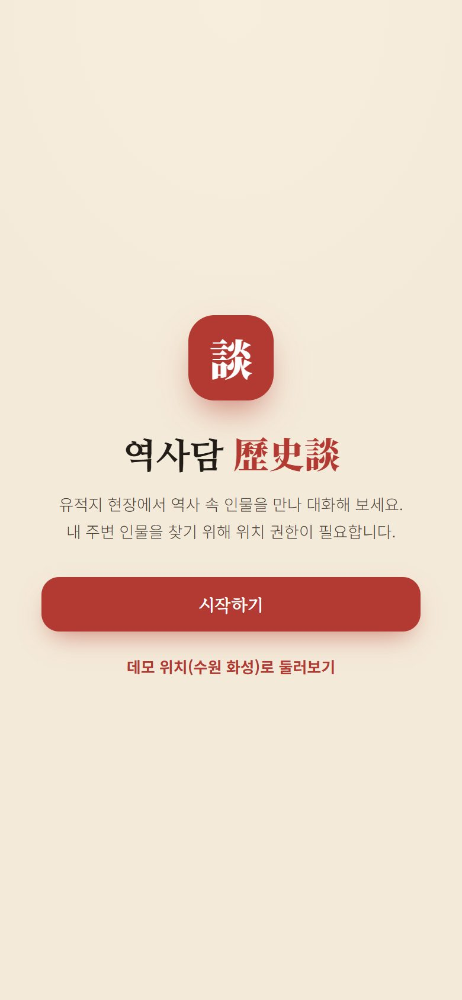</td>
<td>

1. 폰 브라우저(Chrome·Safari)로 배포 주소에 접속합니다.
2. **시작하기** 를 누르고 **위치 권한을 허용**합니다. 내 주변 유적·인물을 찾는 데 쓰입니다.
3. 현장이 아니면 **데모 위치(수원 화성)로 둘러보기** 를 눌러 수원 화성행궁에 있는 것처럼 체험할 수 있습니다.

**홈 화면에 추가하면 앱처럼 쓸 수 있습니다**
- Android Chrome: 메뉴 ⋮ → **홈 화면에 추가** / 앱 설치
- iPhone Safari: 공유 버튼 → **홈 화면에 추가**

홈 화면에서 열면 주소창 없이 **전체 화면**으로 실행됩니다. 브라우저에서 볼 때도 화면을 한 번 누르면 전체 화면으로 바뀝니다.

</td></tr></table>

## 2. 홈 — 내 주변 인물

<table><tr>
<td width="280">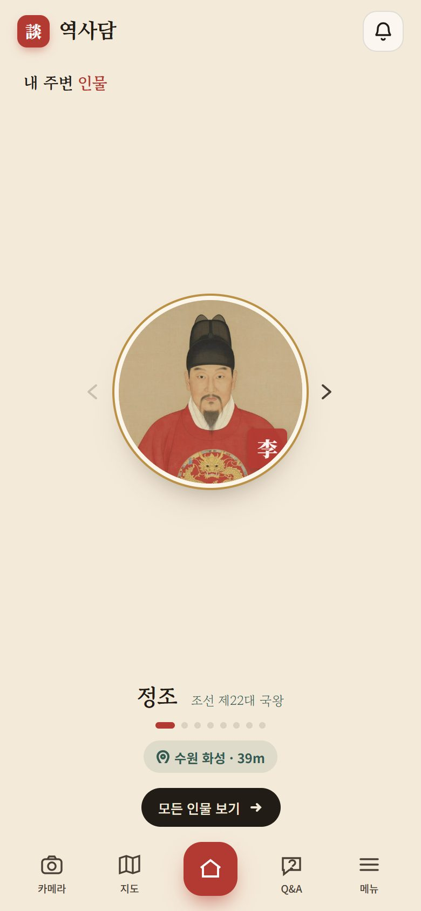</td>
<td>

- 현재 위치에서 **가까운 유적과 관련된 역사 인물**이 초상으로 나옵니다.
- **‹ ›** 또는 옆으로 밀어 다른 인물을 봅니다. 초상 아래에 관련 유적과 거리가 표시됩니다.
- 초상을 누르면 인물 정보와 **대화하기** 가 나옵니다.
- **모든 인물 보기** 로 전체 인물 목록으로 갑니다.
- 오른쪽 위 🔔 는 알림입니다.

하단 탭: **카메라 · 지도 · 홈 · Q&A · 메뉴**

</td></tr></table>

## 3. 지도

<table><tr>
<td width="280">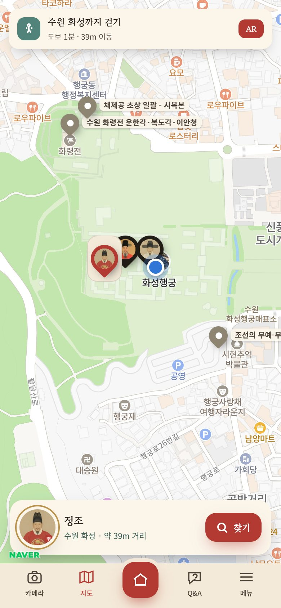</td>
<td>

- 네이버 지도 위에 주변 유적이 표시되고, 파란 점이 내 위치입니다.
- 초상 표시는 인물과 관련된 유적입니다. 표시를 누르면 **유적 상세 카드**가 열립니다.
- 위쪽 안내 막대: 선택한 인물의 유적까지 **걷는 시간·거리**. **AR** 버튼으로 카메라 길 안내로 바꿉니다.
- 아래 카드의 **찾기** 는 그 인물이 있는 유적으로 안내를 시작합니다.

</td></tr></table>

## 4. AR — 카메라로 주변 유적 보기

<table><tr>
<td width="280">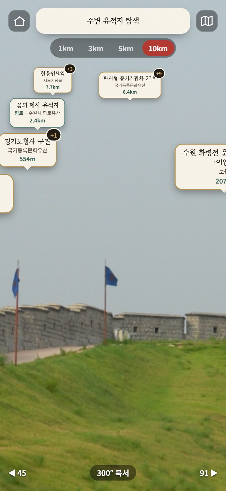</td>
<td width="280">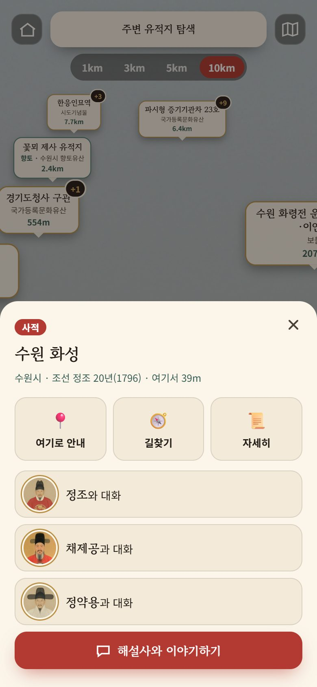</td>
<td>

**들어가기**: 지도 화면의 **AR**, 유적 카드의 **여기로 안내**, 홈의 인물 **찾기**.

1. 폰을 **세워 들고** 주변을 비추면 그 방향의 유적이 말풍선으로 떠오릅니다. 말풍선에는 이름·종류·거리가 나옵니다.
   - 구분: 국가유산은 기본 말풍선, 향토유산은 **청록 테두리 + 「향토」**, 역사관광지(생가)는 **남색 테두리 + 「관광」**
2. 위쪽 **1km · 3km · 5km · 10km** 로 표시 반경을 고릅니다 (기본 10km).
3. 말풍선이 겹치면 **대표 유적만** 보이고 **+N** 이 붙습니다. +N 을 누르면 그 방향의 유적 목록이 열립니다.
4. 말풍선을 누르면 **유적 카드**가 열립니다.
   - **여기로 안내**: 화살표로 방향과 남은 거리를 안내
   - **길찾기**: 네이버 지도 앱으로 길찾기
   - **자세히**: 유적 상세 카드
   - **○○와 대화**: 관련 인물과 대화 / **해설사와 이야기하기**: 인물이 없는 유적은 해설사가 안내
5. 아래 막대는 **나침반 방향**(예: 300° 북서)입니다.

> 화면 버튼은 잠시 뒤 숨겨집니다. **화면을 한 번 누르면** 다시 나타납니다.
> iPhone 은 처음 AR 에 들어갈 때 **동작·방향 접근 허용**을 눌러야 합니다.

</td></tr></table>

## 5. 유적 상세 카드

<table><tr>
<td width="280">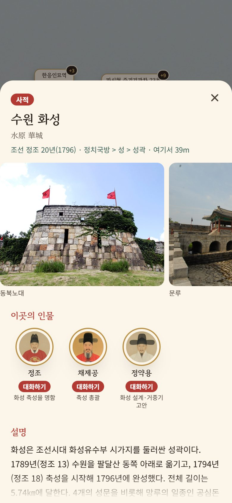</td>
<td>

- 국가유산청·향토유산·경기도 역사관광지 자료로 만든 카드입니다.
  - **사진**: 옆으로 넘겨 보기
  - **이곳의 인물**: 인물마다 **대화하기** 버튼
  - **설명**: 긴 설명은 **더보기** 로 펼침
  - 주소 · ☎ 전화(누르면 전화 걸기)
- 카드 아래쪽 버튼:
  - **해설사와 이야기하기**: 이 유적을 안내하는 해설사와 대화
  - **📍 여기로 안내**: AR 길 안내 / **지도에서 보기**
  - **국가유산포털**(또는 공공데이터포털·경기데이터드림): 원문 출처

</td></tr></table>

## 6. 역사 인물과 대화

<table><tr>
<td width="280">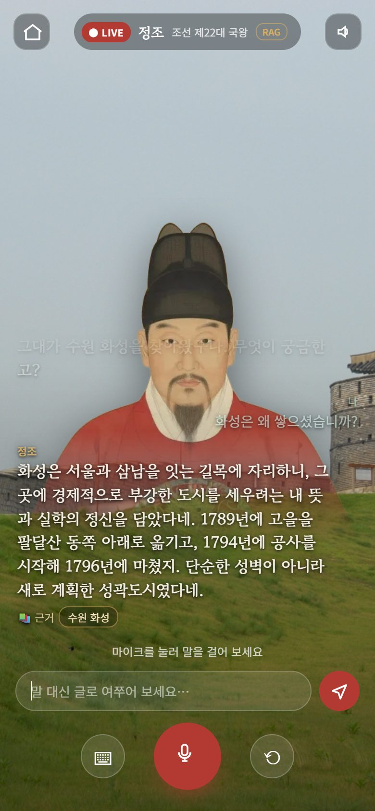</td>
<td>

**화면**
- 후면 카메라 화면 위에 역사 인물이 서 있고, 대화가 **라이브 방송 자막**처럼 흐릅니다.
- 인물의 말은 **목소리**로도 나옵니다.

**말로 묻기**
1. 가운데 **🎤** 를 누르고 말합니다.
2. 말이 끝나면 인물이 답합니다.

**글로 묻기**
1. **⌨** 를 누릅니다.
2. 질문을 입력하고 보냅니다.

**버튼**
- **⟲**: 인물을 화면 정면으로 다시 부르기
- 오른쪽 위 **🔈**: 음성 끄기·켜기
- 인물 이름: 누르면 인물 정보

**RAG 서버 방식일 때**
- 이름 옆에 **RAG** 표시가 붙습니다.
- 답변 아래에 **📚 근거** 로, 답변에 실제로 인용된 유적이 나옵니다.
- 근거를 누르면 그 유적 카드가 열립니다.
- 방식은 [메뉴 → 설정](#9-메뉴--프로필설정역사의-전당)에서 바꿉니다.

> 소리가 나지 않고 **「🔊 화면을 터치하면 목소리가 나와요」** 가 보이면 화면을 한 번 누르세요 (폰 자동 재생 제한).
> 대화 기록은 인물별로 기억되어 다시 들어가면 이어집니다.

</td></tr></table>

## 7. 카메라 — 유물·건물 인식

<table><tr>
<td width="280">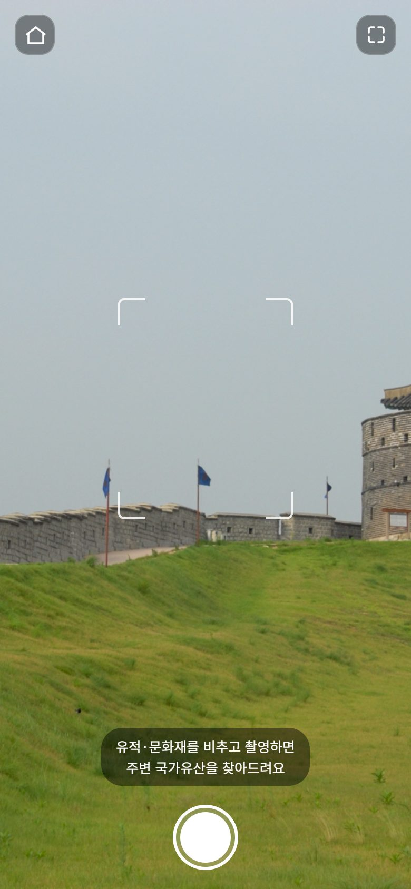</td>
<td width="280">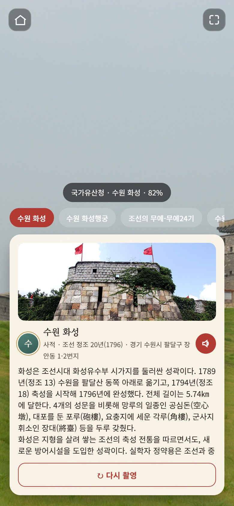</td>
<td>

1. 하단 **카메라** 탭에서 유물·건물을 네모 안에 맞추고 **셔터**를 누릅니다.
2. AI 가 사진과 현재 위치를 함께 보고 **어떤 국가유산인지** 찾습니다.
3. 결과 카드: 이름·지정 종류·시대·설명과 확신도(예: 82%).
   - 🔊 로 설명 듣기
   - 결과는 **역사의 전당**(도감)에 자동 저장
4. 위쪽 후보 칩으로 다른 후보를 고르거나, **다시 촬영** 합니다.

> AI 서버에 연결되지 않으면 **위치 기반**으로 가장 가까운 유적을 보여 줍니다.

</td></tr></table>

## 8. 인물 목록 · Q&A

<table><tr>
<td width="280">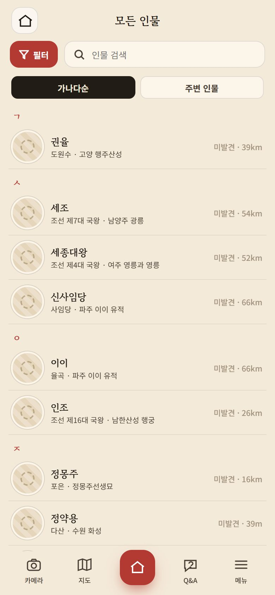</td>
<td width="280">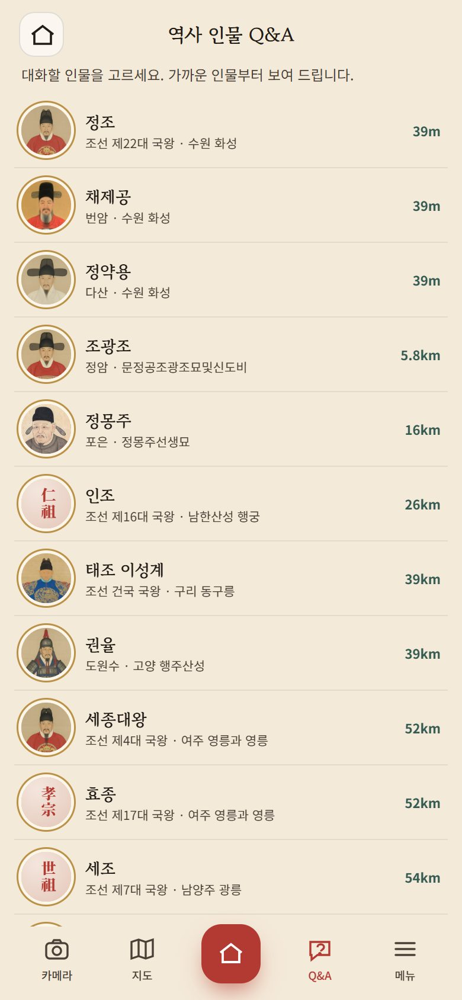</td>
<td>

**모든 인물** (홈 → 모든 인물 보기)
- **가나다순 / 주변 인물** 로 정렬하고, 검색합니다.
- 아직 만나지 않은 인물은 흐리게 **미발견**으로 표시됩니다. 인물의 유적 가까이 가거나 인물 카드를 열면 **만난 인물**이 되어 역사의 전당에 등록됩니다.

**역사 인물 Q&A** (하단 Q&A 탭)
- 가까운 인물 순으로 나오며, 누르면 바로 대화합니다.

</td></tr></table>

## 9. 메뉴 — 프로필·설정·역사의 전당

<table><tr>
<td width="280">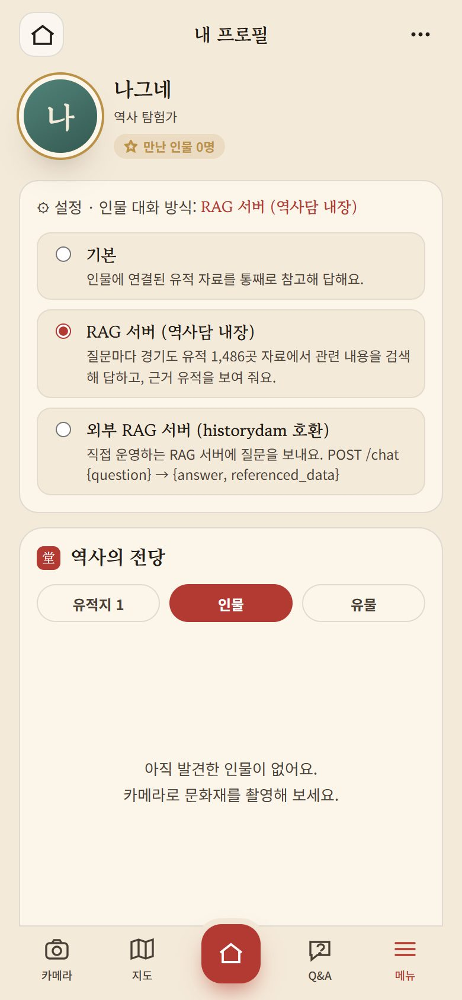</td>
<td>

- 오른쪽 위 **⋯**: 닉네임 바꾸기
- **⚙ 설정 · 인물 대화 방식**: 눌러서 펼칩니다.

| 방식 | 설명 |
|---|---|
| **기본** | 인물에 연결된 유적 자료를 통째로 참고해 답합니다 |
| **RAG 서버 (역사담 내장)** | 질문마다 경기도 유적 1,486곳 자료에서 관련 내용을 **검색**해 답하고, **근거 유적**을 보여 줍니다 |
| **외부 RAG 서버** | 직접 운영하는 RAG 서버 주소(HTTPS)를 넣고 **연결 확인** 후 사용합니다 (historydam 호환) |

**역사의 전당**
- 도착한 **유적지**, 카메라로 인식한 **유물**, 만난 **인물**이 탭별로 모입니다.
- 항목을 누르면 다시 보기와 삭제를 할 수 있습니다.

> 설정·도감은 **이 폰의 브라우저에만** 저장됩니다.

</td></tr></table>

## 10. 알림

<table><tr>
<td width="280">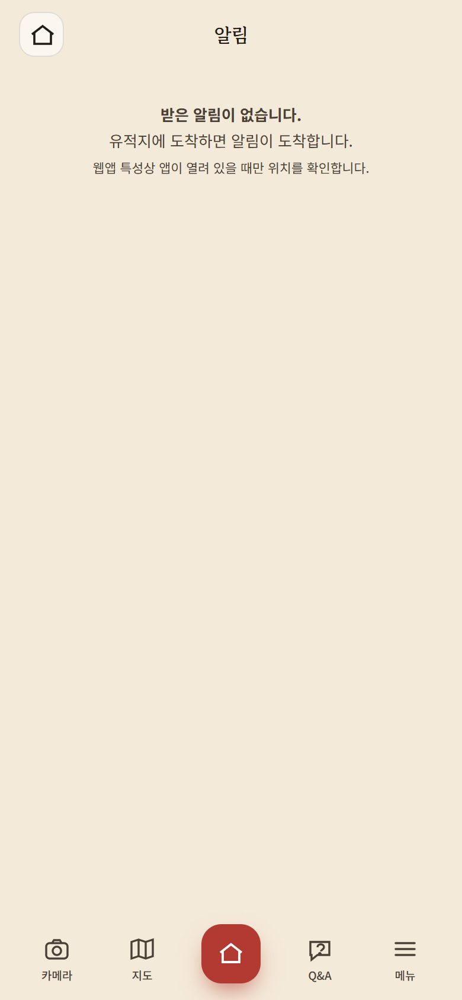</td>
<td>

- 유적지에 **도착하면**(예: 「수원 화성에 도착했습니다」) 또는 **인물을 만날 수 있는 곳**에 가면(예: 「정조를 만날 수 있습니다」) 알림이 쌓입니다.
- 알림을 누르면 그 유적으로 이동합니다.
- 웹앱 특성상 **앱이 열려 있을 때만** 위치를 확인합니다.

</td></tr></table>

## 11. RAG 자료 편집기 (관리자용)

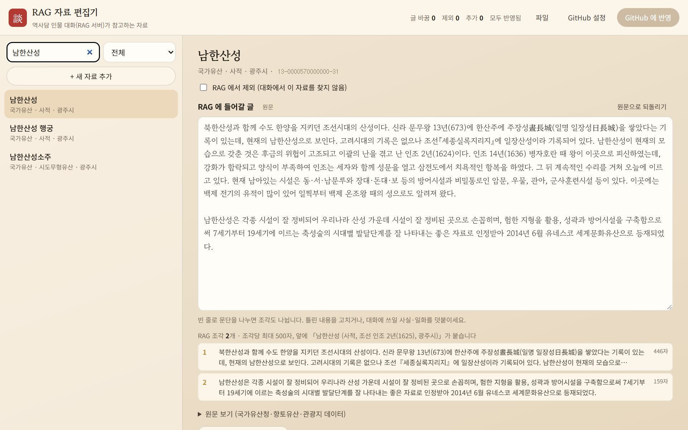

- 주소: **https://samcho93.github.io/arHeritage/editor/**
  - 웹앱 메뉴에는 링크가 없습니다.
  - PC 사용을 권장하지만, 폰에서도 열립니다.
- RAG 서버 방식 대화가 참고하는 글을 고칩니다.

**사용 순서**
1. 왼쪽에서 유적·인물을 검색해 고릅니다. 종류, 「수정·추가·제외」 로 거를 수 있습니다.
2. **RAG 에 들어갈 글**을 고치거나 사실·일화를 덧붙입니다.
   - 아래에 **RAG 조각 미리보기**가 바로 바뀝니다.
   - **원문으로 되돌리기** 로 언제든 원래 글로 돌아갑니다.
3. 대화에 쓰이면 안 되는 자료는 **RAG 에서 제외** 를 켭니다.
4. **+ 새 자료 추가** 로 새 글을 씁니다. 유적·인물에 연결하면 그 인물과 대화할 때 우선 검색됩니다.
5. **🗨 대화로 확인** 으로 배포된 서버에 질문해 답변과 근거를 확인합니다.
6. **GitHub 설정** 에 토큰을 넣습니다 (처음 한 번, 발급 방법은 설정 창에 안내).
7. **GitHub 에 반영** 을 누릅니다. 약 2~3분 뒤 배포가 끝나면 대화에 쓰입니다.

> 작업 내용은 브라우저에 **초안으로 자동 저장**됩니다.
> 토큰이 없으면 **파일 → 작업본 내려받기** 로 넘길 수 있습니다.
> 자세한 구조는 [README 9.3.5](README.md#935-rag-자료-편집기-editor-웹앱과-분리된-관리-도구)를 보세요.

## 12. 자주 묻는 문제

| 증상 | 해결 |
|---|---|
| 주변 유적·인물이 안 나옴 | 위치 권한을 허용했는지 확인 (브라우저 설정 → 사이트 권한 → 위치). 실내에서는 GPS 가 부정확할 수 있음 |
| AR 말풍선이 폰을 돌려도 안 움직임 | iPhone: AR 첫 진입 때 **동작·방향 허용**. 허용을 놓쳤다면 Safari 를 완전히 닫고 다시 열기. PC 에서는 화면을 좌우로 드래그 |
| 카메라가 까맣게 나옴 | 카메라 권한 허용. **HTTPS 주소**로 접속했는지 확인 |
| 인물 목소리가 안 들림 | 폰 무음 모드 해제, 볼륨 확인, 「🔊 화면을 터치하면 목소리가 나와요」 가 보이면 화면 누르기 |
| 음성 인식(🎤)이 안 됨 | Chrome(Android)·Safari(iOS)에서 마이크 권한 허용. 안 되면 ⌨ 로 글 입력 |
| 「인물 대화 서버가 연결되지 않았습니다」 | 잠시 뒤 다시 시도. 계속되면 관리자에게 알림 (Worker 배포 상태) |
| 외부 RAG 서버 연결 실패 | 서버가 **HTTPS** 이고 **CORS** 를 허용하는지 확인 (http 주소는 브라우저가 차단) |
